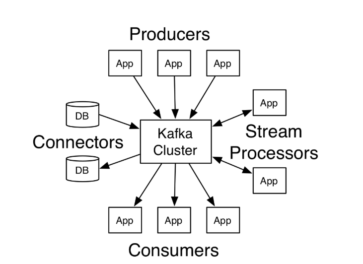
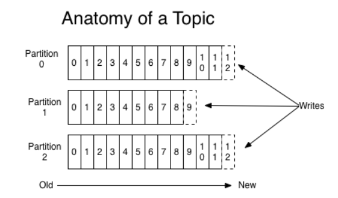
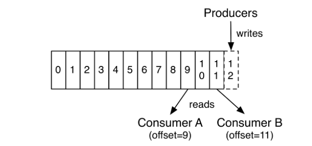
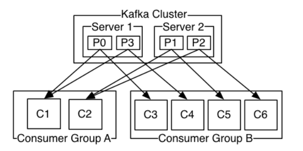
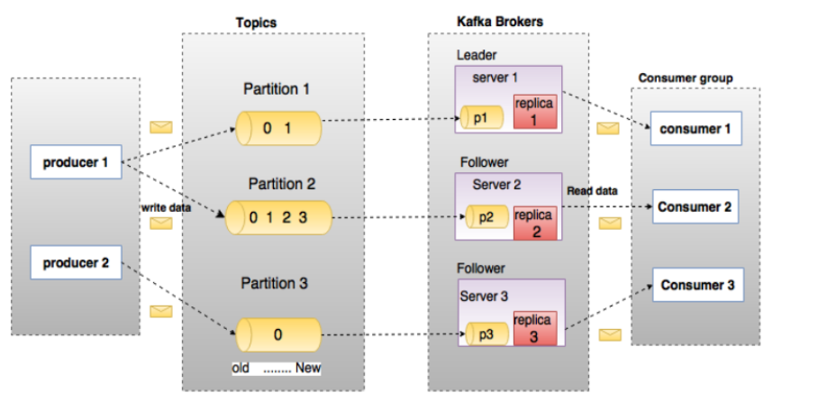
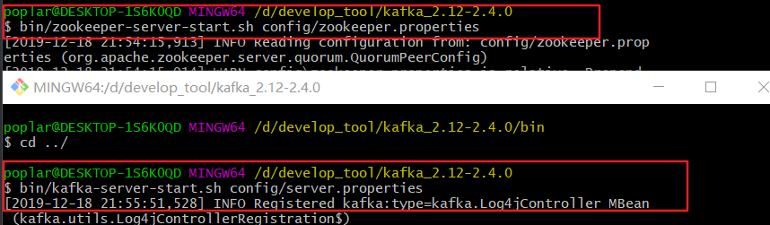

# Kafka粗滤学习

### 官网：<http://kafka.apache.org/>

### Kafka具有四个核心API



### 几个概念：

- Kafka在一个或多个可以跨越多个数据中心的服务器上作为集群运行。

- Kafka集群将*记录*流存储在称为*topic的*类别中。

- 每个记录由一个键，一个值和一个时间戳组成。

  

### 主题和日志

- Kafka中的主题始终是多用户的；也就是说，一个主题可以有零个，一个或多个消费者来订阅写入该主题的数据。

- 对于每个主题，Kafka集群都会维护一个分区日志，如下所示：

  

- 每个分区都是有序的，不变的记录序列，这些记录连续地附加到结构化的提交日志中。每个分区中的记录都分配有一个称为*偏移*的顺序ID号，该ID 唯一地标识分区中的每个记录。

- Kafka群集使用可配置的保留期限持久地保留所有已发布的记录（无论是否已使用它们）。例如，如果将保留策略设置为两天，则在发布记录后的两天内，该记录可供使用，之后将被丢弃以释放空间。Kafka的性能相对于数据大小实际上是恒定的，因此长时间存储数据不是问题。



- 实际上，基于每个消费者保留的唯一元数据是该消费者在日志中的偏移量或位置。此偏移量由使用者控制：通常，使用者在读取记录时会线性地推进其偏移量，但是实际上，由于位置是由使用者控制的，因此它可以按喜欢的任何顺序使用记录。例如，使用者可以重置到较旧的偏移量以重新处理过去的数据，或者跳到最近的记录并从“现在”开始使用。

### 分部署

- 日志的分区分布在Kafka群集中的服务器上，每个服务器处理数据并要求共享分区。每个分区都在可配置数量的服务器之间复制，以实现容错功能。

  每个分区都有一个充当“领导者”的服务器和零个或多个充当“跟随者”的服务器。领导者处理对分区的所有读写请求，而跟随者则被动地复制领导者。如果领导者失败，则跟随者之一将自动成为新领导者。每个服务器充当其某些分区的领导者，而充当其他分区的跟随者，因此群集中的负载得到了很好的平衡。

### 生产者

- 生产者将数据发布到他们选择的主题。生产者负责选择将哪个记录分配给主题中的哪个分区。可以以循环方式完成此操作，仅是为了平衡负载，也可以根据某些语义分区功能（例如基于记录中的某些键）进行此操作。一秒钟就可以了解更多有关分区的信息！

### 消费者

- 消费者使用***消费者组*名称**标记自己，并且发布到主题的每条记录都会传递到每个订阅消费者组中的一个消费者实例。使用者实例可以在单独的进程中或在单独的机器上。

- 如果所有使用者实例都具有相同的使用者组，那么将在这些使用者实例上有效地平衡记录。

- 如果所有使用者实例具有不同的使用者组，则每条记录将广播到所有使用者进程。



- 卡夫卡相关术语之间的关系



- 卡夫卡使用zookeeper做为协调中心，所以启动时务必先启动zookeeper后再启动Kafka
- 参考：



- 命令创建主题：

```java
bin/kafka-topics.sh --create --zookeeper localhost:2181 --replication-factor 1 --partitions 1 --topic myTopc

```

- 启动一个生产者向主题发送消息

```java
bin/kafka-console-producer.sh --broker-list localhost:9092 --topic myTopic

```


- 启动一个消费者监听指定的端口的主题

```java
bin/kafka-console-consumer.sh --bootstrap-server localhost:9092 --topic myTopic

```

