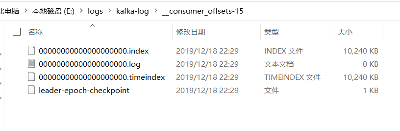

# Kafka粗滤学习

### 官网：<http://kafka.apache.org/>

### Kafka具有四个核心API


### 几个概念：

- Kafka在一个或多个可以跨越多个数据中心的服务器上作为集群运行。

- Kafka集群将*记录*流存储在称为*topic的*类别中。

- 每个记录由一个键，一个值和一个时间戳组成。

  

### 主题和日志

- Kafka中的主题始终是多用户的；也就是说，一个主题可以有零个，一个或多个消费者来订阅写入该主题的数据。

- 对于每个主题，Kafka集群都会维护一个分区日志，如下所示：

  

- 每个分区都是有序的，不变的记录序列，这些记录连续地附加到结构化的提交日志中。每个分区中的记录都分配有一个称为*偏移*的顺序ID号，该ID 唯一地标识分区中的每个记录。

- Kafka群集使用可配置的保留期限持久地保留所有已发布的记录（无论是否已使用它们）。例如，如果将保留策略设置为两天，则在发布记录后的两天内，该记录可供使用，之后将被丢弃以释放空间。Kafka的性能相对于数据大小实际上是恒定的，因此长时间存储数据不是问题。


- 实际上，基于每个消费者保留的唯一元数据是该消费者在日志中的偏移量或位置。此偏移量由使用者控制：通常，使用者在读取记录时会线性地推进其偏移量，但是实际上，由于位置是由使用者控制的，因此它可以按喜欢的任何顺序使用记录。例如，使用者可以重置到较旧的偏移量以重新处理过去的数据，或者跳到最近的记录并从“现在”开始使用。

### 分部署

- 日志的分区分布在Kafka群集中的服务器上，每个服务器处理数据并要求共享分区。每个分区都在可配置数量的服务器之间复制，以实现容错功能。

  每个分区都有一个充当“领导者”的服务器和零个或多个充当“跟随者”的服务器。领导者处理对分区的所有读写请求，而跟随者则被动地复制领导者。如果领导者失败，则跟随者之一将自动成为新领导者。每个服务器充当其某些分区的领导者，而充当其他分区的跟随者，因此群集中的负载得到了很好的平衡。

### 生产者

- 生产者将数据发布到他们选择的主题。生产者负责选择将哪个记录分配给主题中的哪个分区。可以以循环方式完成此操作，仅是为了平衡负载，也可以根据某些语义分区功能（例如基于记录中的某些键）进行此操作。一秒钟就可以了解更多有关分区的信息！

### 消费者

- 消费者使用***消费者组*名称**标记自己，并且发布到主题的每条记录都会传递到每个订阅消费者组中的一个消费者实例。使用者实例可以在单独的进程中或在单独的机器上。

- 如果所有使用者实例都具有相同的使用者组，那么将在这些使用者实例上有效地平衡记录。

- 如果所有使用者实例具有不同的使用者组，则每条记录将广播到所有使用者进程。


- 卡夫卡相关术语之间的关系


- 卡夫卡使用zookeeper做为协调中心，所以启动时务必先启动zookeeper后再启动Kafka
- 参考：


- 命令创建主题：

```java
bin/kafka-topics.sh --create --zookeeper localhost:2181 --replication-factor 1 --partitions 1 --topic myTopc

```

- 启动一个生产者向主题发送消息

```java
bin/kafka-console-producer.sh --broker-list localhost:9092 --topic myTopic

```


- 启动一个消费者监听指定的端口的主题

```java
bin/kafka-console-consumer.sh --bootstrap-server localhost:9092 --topic myTopic

```

### 关于分区：

- 分区都是一个有序,不可变的消息序列,后续新来的消息会深源不断地,持续追加到分区的后面,这相当子一种结构化的提交日志(类似于Git的提交日志。
- 分区中每一条消息都会被分配到一个连续的id值（即offset），该值用于唯一标志分区中的每条消息。
- **分区的重要作用**：
  - 分区中的消息数据是存储在日志文件中的,而且同一分区中的消息数据是按照发送顺序严格有序的,分区在逻辑上对应一个日志,当生产者将消息写入分区中时，实际上是写到了分区所对应的日志当中,而日志可以看作是一种逻辑上的概念,它对应于磁盘上的一个目录,一个日志文件由多个段(Segment)来构成,每个Segment对应一个素引文件与一个日志文件，
  - 借助于分区,我们可以实现Kafka服务器的水平扩展,对于一台机器来说,无论是物理机还是虚拟机,其运行能力总归是有上跟的,当一台机器到达其能力法再扩展了,即垂直扩展能力总是受到硬件制约的,通过使用分区,我们可以将一个主题中的消息分散到不同的**卡夫卡**服务器上(这里需要使用Kafka集群）这样当机器的能力不足时,我们只需要添加机器就可以了,在新的机器上创建新的分区,这样理论上就可以实现无限的水平扩展能力。
  - 分区还可以实现并行处理能力,向一个主题所发送的消息会发送给该主题所拥有的不同的分区中,这样消息就可以实现并行发送与处理,由多个分区来接收。

### Segment（段）

- 一个分区（partition）是由一系列有序,不可变的消息所构成的,一个分区中的消息数量可能会非常多,因此显然不能将所有消息都保存到一个文件中，因此，类似于log4j的rolling log,当分区中的消息数量增长到一定程度之后,消息文件会进行切割,新的消息会被写到一个新的文件当中,以此类推;这一个个新的数据文件我们就称之为Segment(段)。
- 因此一个partition在物理上是由一个或者多个Segment(段)所构成的,每个段中则保存了真实的消息数据.

### 关于分区与Segment之间的关系

1. 每个分区都相当于一个大型文件被分配到多个大小相等的Segment数据文件中,每个Segment中的消息数量未必相等(这与消息大小有密切的关系,不同的消息所占据的磁盘空间显然是不一样的),这个特点使得老的部分文件可以很容易就被删除掉,有助于提升磁盘利用效率。
2. 分区只需要支持顺序读写即可,Segment文件的生命周期是由**Kafka**服务器的配置参数所决定的,比如说. properties文件中的参数项log.retention.hours=168就表示7天后删除老的消息文件。
3. 区目录中的4个文件的含义与作用
   - 0000000000000 .indet它是Segment文件的索引文件,它与接下来我们要介绍的00000000000000.log文件是成对出现的。后缓index就表示这是个索引文件。
   - 00000000000000.log Segment文件的数据文件,用于存储实际的消息,该文件是二进制格式的。Segment文件的命名规则是partition全局的第一个seament从0开始,后续每个Segment文件名为上一个段文件最后一条消息的偏移值,没有数字则用一个0填充，由于这里的主题的消息数量较少,因此只有一个数据文件。
   - 0000000000.timeindex:该文件是一个基于消息日期的素引文件,主要用途是在一些根据日期或是时间来寻找消息的场景下使用，此外，基于时间日志的rolling或保留策路等情况下也会使用。实际上,该文件是在Kafka较新的版本中才增加,在老本Kafka是没有该文件的。它是对“.index文件有益补充。*.index文件是基于偏移量的索引文件,而”,.timeindex则是基于时间戳的的索引文件。
   - leader-epoch-checkpoint:是leader的一个缓存文件,实际上,它是与卡夫卡的HW(高水)与LEO(LOG ENF Offset)相关重要文件。
   
   

